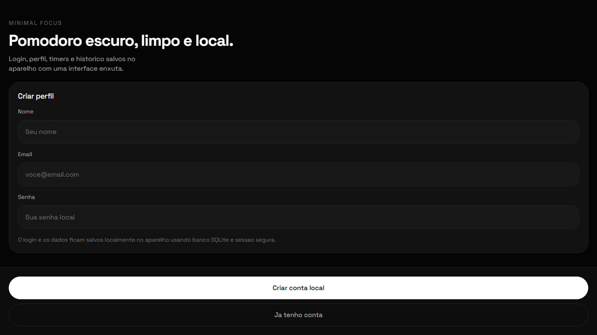
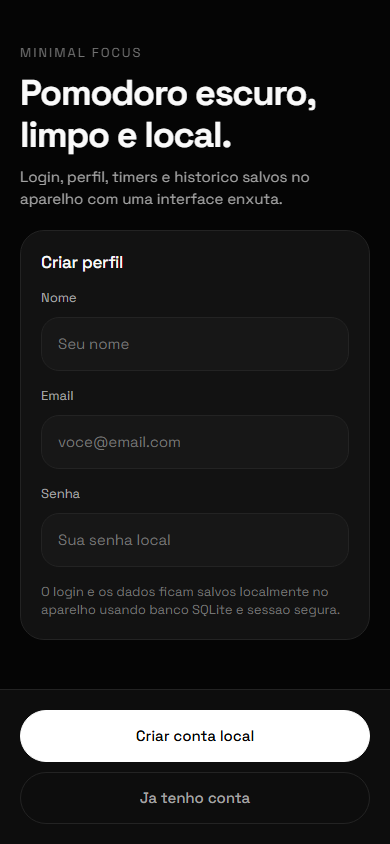

# Meu Pomodoro

## Descricao

Aplicativo Pomodoro com sessao de foco, historico, presets, autenticacao local, biometria opcional, SQLite e sons de feedback.

## Demonstracao Visual

| Desktop | Mobile |
| --- | --- |
|  |  |

## Funcionalidades

- Cadastro e login local
- Timer Pomodoro com fases de foco e pausa
- Presets personalizaveis
- Historico de sessoes
- Persistencia em SQLite
- Sessao segura com SecureStore
- Sons e notificacoes locais

## Tecnologias

- Expo
- React Native
- TypeScript
- SQLite
- SecureStore
- Zustand
- React Navigation
- Zod

## Estrutura

- `.gitignore`
- `App.tsx`
- `README.md`
- `app.json`
- `assets/`
- `docs/`
- `index.ts`
- `package-lock.json`
- `package.json`
- `src/`
- `tsconfig.json`

## Requisitos

- Node.js 18 ou superior
- npm
- Expo CLI via npx
- Expo Go opcional

## Instalacao

- npm install

## Variaveis de Ambiente

- Nao utiliza variaveis de ambiente.

## Comandos Disponiveis

| Acao | Comando |
| --- | --- |
| Iniciar | `npm start` |
| Web | `npm run web` |
| Typecheck | `npm run typecheck` |
| Android | `npm run android` |
| iOS | `npm run ios` |

## Execucao

Execute npm start e abra no Expo Go, emulador ou web quando disponivel.

## Build

Use EAS Build ou expo export conforme o alvo de publicacao.

## Observacoes

- Recursos como biometria, audio e SecureStore dependem do ambiente nativo.

## Autor

Maxsuel Oliveira

## Licenca

Este projeto esta licenciado sob a licenca MIT.
